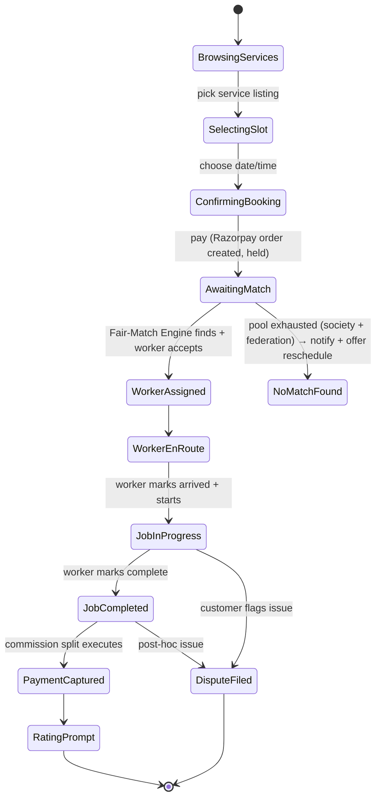
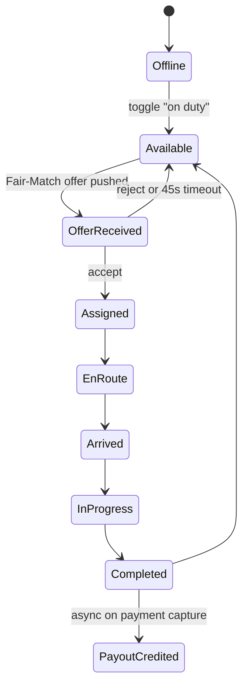
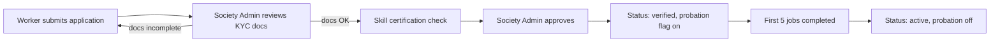
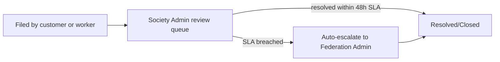

# appflow.md — End-to-End User Journeys

## 1. Customer Booking Journey

**Key screen sequence (customer web):** Home (category grid, icon-first) → Category listing → Service detail (transparent price shown here, including the 12% breakdown on tap — "See where your money goes") → Slot picker → Address confirm → Payment → Live tracking (map + status timeline) → Completion → Rate & review.

## 2. Worker Job Journey

**Key screen sequence (worker app):** Login (OTP) → Home (on-duty toggle, today's job count vs society median — visible fairness signal, see note below) → Offer card (accept/reject, 45s countdown) → Navigation view (map + customer contact) → Status buttons (arrived/start/complete) → Payout tab → Welfare fund tab → Voice assistant toggle (Hindi/Marathi).

> Design note: showing the worker their own `jobs_this_week` vs `society_median_jobs_this_week` (the same numbers driving `rotation_fairness_score`) directly in the app is a deliberate transparency choice — it makes the cooperative's fairness mechanism visible and legible to the people it's meant to protect, not just something the admin can see. This is worth calling out explicitly in the pitch as a UX decision, not just a backend one.

## 3. Cooperative Admin Journey (Worker Onboarding)

## 4. Dispute Journey

## 5. Federation Oversight Journey

Federation Admin logs in → sees aggregate dashboard (societies list with worker count, active jobs, avg rating, welfare fund balance) → drills into one society (read-only for worker-level records, respecting society autonomy — see `architecture.md` §4) → welfare fund audit trail across all societies → exportable report (for NCCT-level reporting).
