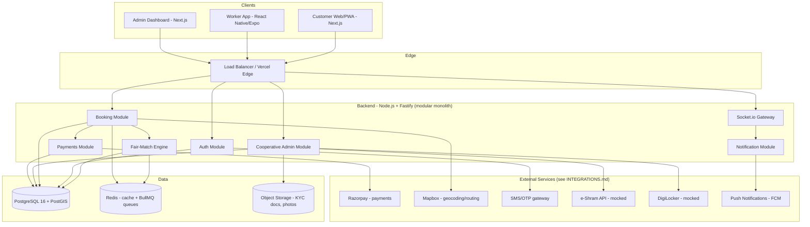

# architecture.md

## 1. System Overview

SahakarConnect is built as a **modular monolith** for the hackathon, not microservices — this is a deliberate feasibility decision, not a limitation to hide. Microservices add operational overhead (service discovery, distributed tracing, inter-service auth) that buys nothing at hackathon scale and actively increases the risk of a demo-day outage. The backend is structured in clearly separated modules with clean interfaces, so it is honestly describable to judges as "separable into services post-hackathon without a rewrite" — and that claim is true because of how the modules are bounded (see §3).

## 2. Client Applications

| App | Stack | Deployed as | Demo mechanism |
|---|---|---|---|
| Customer Web | Next.js 14 PWA | Vercel | Live URL, installable on judges' phones |
| Worker App | React Native (Expo managed) | Expo Go / EAS Android build | QR code scan → Expo Go for instant live install, huge for demo credibility |
| Admin Dashboard | Next.js 14 (separate route group, shared codebase with Customer Web repo but distinct auth/RBAC) | Vercel | Live URL, projected during pitch |

## 3. Backend Module Boundaries

Each module below owns its own data access and exposes only through defined service interfaces — this is what makes the "separable to microservices later" claim real rather than aspirational:

- **Auth Module** — user identity, JWT issuance, OTP verification, RBAC role resolution.
- **Booking Module** — service catalog, booking lifecycle state machine, orchestrates Fair-Match calls.
- **Fair-Match Engine (FME)** — pure scoring/decision module (see `COOP_BUSINESS_LOGIC.md` §1); takes a job + candidate pool, returns ranked offers. Deliberately isolated so its logic can be unit-tested independent of the booking flow, and swapped for a more sophisticated model later without touching booking code.
- **Payments Module** — Razorpay integration, commission-split calculation, payout ledger writes.
- **Cooperative Admin Module** — worker onboarding/verification, society/federation scoping, dispute and welfare-fund workflows.
- **Notification Module** — Socket.io realtime events + FCM push, decoupled via a lightweight internal event bus (Redis pub/sub) so other modules just emit events without knowing delivery mechanics.

## 4. Security & RBAC

Five roles, enforced server-side on every request (never client-trusted):

| Role | Scope |
|---|---|
| `customer` | Own bookings, own profile, own disputes |
| `worker` | Own job offers/assignments, own payout ledger, own profile |
| `society_admin` | All workers/jobs/disputes/welfare claims within their one Cooperative Society |
| `federation_admin` | Aggregate read across all societies in their Federation; welfare fund audit; cannot edit individual society-level worker records directly (respects society autonomy — a real cooperative governance principle, not just an access-control convenience) |
| `platform_admin` | Full access — reserved for the tech team / NCCT technical oversight, heavily audit-logged |

Data isolation is enforced at the query layer (every society-scoped query includes `WHERE society_id = :callerSocietyId` derived from the JWT claim, never from a client-supplied parameter) — this is the kind of detail worth stating explicitly in a security Q&A with judges.

## 5. Realtime Job Dispatch Flow

1. Customer confirms booking → Booking Module writes `booking` row, status `pending_match`.
2. Booking Module calls FME with job + location + skill.
3. FME queries candidate pool from PostGIS (radius query) + Redis (live availability cache) → returns ranked list.
4. Booking Module pushes offer to top-ranked worker via Socket.io; starts a `BullMQ` delayed job for `OFFER_TIMEOUT_SECONDS`.
5. Worker accepts (Socket event) → booking status `assigned`, timeout job cancelled. Worker rejects/timeout → next-ranked worker offered, repeat.
6. If pool exhausted at society level → federation-level pool considered (see `COOP_BUSINESS_LOGIC.md` §1.4).

## 6. Scalability Notes (for the feasibility Q&A, not implemented at hackathon scale)

- PostGIS radius queries indexed via GiST index on worker location — scales to tens of thousands of workers per society without redesign.
- Redis availability cache avoids hitting Postgres for every dispatch tick.
- Modular monolith → each module's data access is already namespaced, so a future split (e.g. Payments as its own service for PCI-scope isolation) is a deployment change, not a rewrite.
- Not implemented for hackathon: horizontal autoscaling, multi-region — correctly out of scope, and saying so plainly is more credible than a slide claiming "infinitely scalable."
