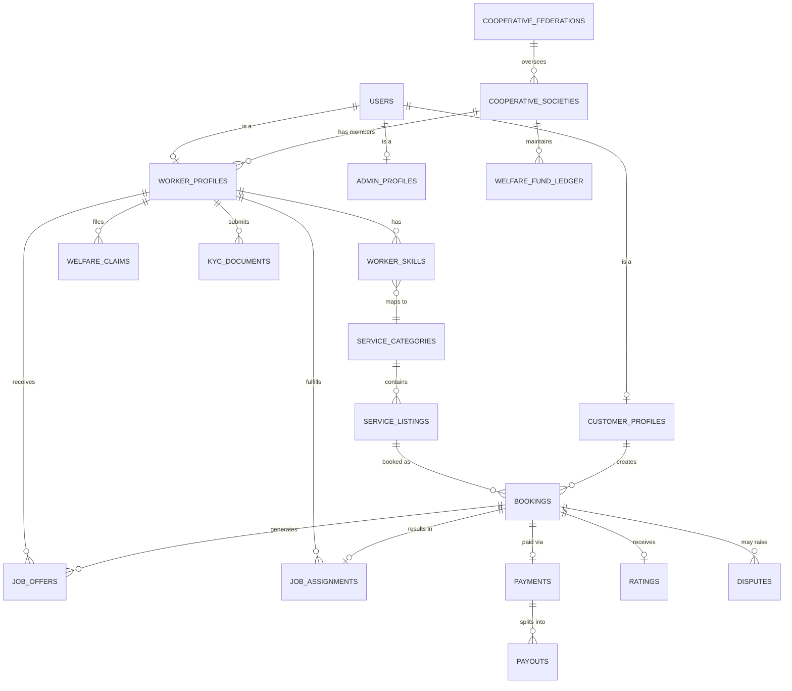

# schema.md — Consolidated Database Schema

Source of truth for all Prisma migrations. If code and this file disagree, this file wins — update it in the same commit as any migration change (see `rules.md` §2).

## 1. ERD



## 2. Table Definitions

Types shown as Prisma-style / Postgres-equivalent. All tables: `id UUID PRIMARY KEY DEFAULT gen_random_uuid()`, `created_at TIMESTAMPTZ DEFAULT now()`, `updated_at TIMESTAMPTZ` (auto-updated), unless noted.

### `users`
| Column | Type | Constraints |
|---|---|---|
| phone_number | VARCHAR(15) | UNIQUE NOT NULL |
| email | VARCHAR(255) | UNIQUE, nullable |
| password_hash | VARCHAR(255) | nullable (OTP-only login also supported) |
| role | ENUM(customer, worker, society_admin, federation_admin, platform_admin) | NOT NULL |
| full_name | VARCHAR(255) | NOT NULL |
| preferred_language | VARCHAR(10) | DEFAULT 'hi' |
| is_active | BOOLEAN | DEFAULT true |

### `cooperative_federations`
| Column | Type | Constraints |
|---|---|---|
| name | VARCHAR(255) | NOT NULL |
| region | VARCHAR(255) | e.g. state |
| ncct_registration_id | VARCHAR(100) | nullable |

### `cooperative_societies`
| Column | Type | Constraints |
|---|---|---|
| federation_id | UUID | FK → cooperative_federations, NOT NULL |
| name | VARCHAR(255) | NOT NULL |
| district | VARCHAR(255) | |
| primary_trade_focus | VARCHAR(255) | nullable, e.g. "Electricians" |
| max_dispatch_radius_km | DECIMAL(5,2) | DEFAULT 8.0 |

### `worker_profiles`
| Column | Type | Constraints |
|---|---|---|
| user_id | UUID | FK → users, UNIQUE NOT NULL |
| society_id | UUID | FK → cooperative_societies, NOT NULL |
| status | ENUM(applicant, documents_pending, verified, active, suspended, inactive) | DEFAULT 'applicant' |
| is_probation | BOOLEAN | DEFAULT true |
| home_location | GEOGRAPHY(POINT, 4326) | PostGIS — indexed GiST |
| current_location | GEOGRAPHY(POINT, 4326) | updated on shift-start, indexed GiST |
| is_available | BOOLEAN | DEFAULT false |
| rolling_avg_rating | DECIMAL(3,2) | DEFAULT NULL (until ≥5 jobs) |
| completed_jobs_count | INTEGER | DEFAULT 0 |
| jobs_this_week_count | INTEGER | DEFAULT 0 — reset by scheduled job, also derivable from `job_assignments`, cached here for FME read speed |

### `worker_skills`
| Column | Type | Constraints |
|---|---|---|
| worker_id | UUID | FK → worker_profiles, NOT NULL |
| category_id | UUID | FK → service_categories, NOT NULL |
| certification_level | ENUM(basic, certified, senior) | DEFAULT 'basic' |
| UNIQUE(worker_id, category_id) | | |

### `customer_profiles`
| Column | Type | Constraints |
|---|---|---|
| user_id | UUID | FK → users, UNIQUE NOT NULL |
| default_address | TEXT | |
| default_location | GEOGRAPHY(POINT, 4326) | |

### `service_categories`
| Column | Type | Constraints |
|---|---|---|
| name | VARCHAR(100) | NOT NULL, e.g. "Electrical", "Domestic Help" |
| icon_key | VARCHAR(50) | for icon-first low-literacy UI, see `design.md` |

### `service_listings`
| Column | Type | Constraints |
|---|---|---|
| category_id | UUID | FK → service_categories |
| name | VARCHAR(255) | e.g. "Fan installation" |
| base_price | DECIMAL(10,2) | flat, transparent (no surge) |
| estimated_duration_minutes | INTEGER | |

### `bookings`
| Column | Type | Constraints |
|---|---|---|
| customer_id | UUID | FK → customer_profiles |
| listing_id | UUID | FK → service_listings |
| society_id | UUID | FK → cooperative_societies — resolved at booking time based on customer location |
| status | ENUM(pending_match, offered, assigned, in_progress, completed, cancelled, disputed) | DEFAULT 'pending_match' |
| scheduled_slot_start | TIMESTAMPTZ | |
| service_location | GEOGRAPHY(POINT, 4326) | |
| service_address_text | TEXT | |
| total_price | DECIMAL(10,2) | snapshot at booking time |

### `job_offers`
| Column | Type | Constraints |
|---|---|---|
| booking_id | UUID | FK → bookings |
| worker_id | UUID | FK → worker_profiles |
| fair_match_score | DECIMAL(5,4) | logged for explainability (see COOP_BUSINESS_LOGIC §1) |
| score_breakdown | JSONB | `{proximity, rating, fairness, skill}` — powers the admin explainability panel |
| status | ENUM(pending, accepted, rejected, expired) | DEFAULT 'pending' |
| offered_at | TIMESTAMPTZ | |
| responded_at | TIMESTAMPTZ | nullable |

### `job_assignments`
| Column | Type | Constraints |
|---|---|---|
| booking_id | UUID | FK → bookings, UNIQUE |
| worker_id | UUID | FK → worker_profiles |
| status | ENUM(en_route, arrived, in_progress, completed, no_show) | |
| started_at / completed_at | TIMESTAMPTZ | nullable |

### `payments`
| Column | Type | Constraints |
|---|---|---|
| booking_id | UUID | FK → bookings, UNIQUE |
| razorpay_order_id | VARCHAR(255) | |
| amount | DECIMAL(10,2) | |
| status | ENUM(created, captured, failed, refunded) | |
| worker_payout_amount | DECIMAL(10,2) | = amount * 0.88 |
| tech_ops_fee_amount | DECIMAL(10,2) | = amount * 0.05 |
| welfare_contribution_amount | DECIMAL(10,2) | = amount * 0.04 |
| federation_fee_amount | DECIMAL(10,2) | = amount * 0.03 |

### `payouts`
| Column | Type | Constraints |
|---|---|---|
| worker_id | UUID | FK → worker_profiles |
| payment_id | UUID | FK → payments |
| amount | DECIMAL(10,2) | |
| status | ENUM(pending, paid) | |
| paid_at | TIMESTAMPTZ | nullable |

### `welfare_fund_ledger`
| Column | Type | Constraints |
|---|---|---|
| society_id | UUID | FK → cooperative_societies |
| entry_type | ENUM(contribution, claim_payout) | |
| amount | DECIMAL(10,2) | positive for contribution, negative for payout |
| related_payment_id | UUID | nullable FK |
| related_claim_id | UUID | nullable FK |
| running_balance | DECIMAL(12,2) | denormalized for fast admin dashboard read |

### `welfare_claims`
| Column | Type | Constraints |
|---|---|---|
| worker_id | UUID | FK → worker_profiles |
| category | ENUM(medical, accident, equipment, other) | |
| description | TEXT | |
| document_url | VARCHAR(500) | nullable |
| status | ENUM(filed, approved, rejected, paid) | |
| reviewed_by | UUID | nullable FK → users (admin) |
| review_note | TEXT | nullable |

### `ratings`
| Column | Type | Constraints |
|---|---|---|
| booking_id | UUID | FK → bookings, UNIQUE |
| worker_id | UUID | FK → worker_profiles |
| stars | SMALLINT | CHECK (1–5) |
| comment | TEXT | nullable |
| flagged_for_review | BOOLEAN | DEFAULT false — auto-true if stars < 2, see COOP_BUSINESS_LOGIC §3 |

### `disputes`
| Column | Type | Constraints |
|---|---|---|
| booking_id | UUID | FK → bookings |
| filed_by_user_id | UUID | FK → users |
| category | ENUM(quality, no_show, payment, damage, conduct, other) | |
| description | TEXT | |
| evidence_urls | TEXT[] | |
| status | ENUM(filed, society_review, escalated_to_federation, resolved, closed) | |
| sla_deadline | TIMESTAMPTZ | filed_at + 48h |

### `kyc_documents`
| Column | Type | Constraints |
|---|---|---|
| worker_id | UUID | FK → worker_profiles |
| doc_type | ENUM(aadhaar, e_shram_card, skill_certificate, police_verification, other) | |
| storage_url | VARCHAR(500) | encrypted at rest |
| verification_status | ENUM(pending, verified, rejected) | |
| verified_via | ENUM(manual, e_shram_mock, digilocker_mock) | see `INTEGRATIONS.md` |

### `notifications`
| Column | Type | Constraints |
|---|---|---|
| user_id | UUID | FK → users |
| type | VARCHAR(50) | e.g. 'job_offer', 'booking_confirmed', 'welfare_claim_update' |
| payload | JSONB | |
| read_at | TIMESTAMPTZ | nullable |

## 3. Key Indexes

```sql
CREATE INDEX idx_worker_current_location ON worker_profiles USING GIST (current_location);
CREATE INDEX idx_booking_service_location ON bookings USING GIST (service_location);
CREATE INDEX idx_worker_society_status ON worker_profiles (society_id, status) WHERE status = 'active';
CREATE INDEX idx_job_offers_booking ON job_offers (booking_id, status);
CREATE INDEX idx_disputes_sla ON disputes (sla_deadline) WHERE status IN ('filed','society_review');
```
